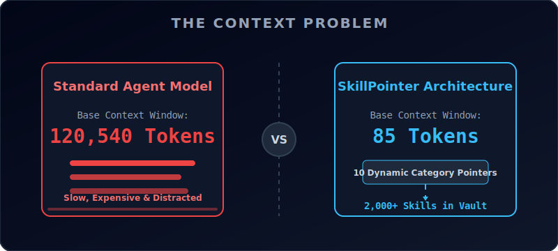

<div align="center">
  

  # SkillPointer PRO 🎯
  
  **Infinite AI Context. Zero Token Tax.**
  
  [](https://opensource.org/licenses/MIT)
  [](https://www.python.org/downloads/)
  [](https://github.com/blacksiders/SkillPointer)
</div>

<br/>

SkillPointer is a cutting-edge **Retrieval-Augmented Generation (RAG) architectural pattern** specifically engineered for OpenCode, Claude Code, and other local AI development agents.

It solves the biggest problem with massive AI skill libraries: **Context Window Bloat**.

---

## 🛑 The "Token Tax" Problem

When you install community skill packs (e.g., hundreds of animation principles, API guidelines, frontend best practices), your AI agent automatically scans all of them and loads their descriptions into its background context window on *every single prompt*. 

If you have 2,000 skills, that requires thousands of tokens just for the AI to "remember" what it knows, before it even looks at a single line of your actual codebase.

* **It vastly slows down AI response times.**
* **It drastically inflates API costs.**
* **It degrades reasoning** (often causing timeouts or unrelated hallucinations during deep research tasks).

---

## ⚡ The Pointer Solution

<div align="center">
  
</div>
<br>

SkillPointer completely hacks your agent's context model natively by reorganizing your library:

1. **Hidden Vault Storage:** It moves all of your raw skills into an isolated directory (e.g., `~/.opencode-skill-libraries/`). The AI's native startup scanner cannot see them here.
2. **Category Pointers:** It replaces those 2,000 skills with a handful (e.g., 10-30) of lightweight "Pointer Skills" inside your active `skills/` directory (e.g., `web-dev-category-pointer`).
3. **Dynamic Retrieval:** When you ask a question, the AI only reads the pointers. The pointer instructs the AI: *"I don't have the skills loaded, but you must use your command-line tools to read the hidden vault and find the exact file you need first."*

**The result?** The AI can access 10,000+ skills instantaneously, but its baseline background context is essentially zero.

---

## 🚀 Installation & Setup

We have provided a beautiful, zero-dependency Python script that will instantly convert your bloated skills directory into a blazingly fast Hierarchical Pointer Architecture.

### Step 1: Run the Setup Script
Download and run the provided `setup.py` script. The PRO engine will automatically categorize your flat skills into dozens of distinct expert domains (e.g., `ai-ml`, `security`, `frontend`, `automation`) using our built-in keyword heuristic engine.

```bash
python setup.py
```

### Step 2: Test Your Infinite Context!
Start your AI agent and ask it to fetch a specific skill. For example:
> *"I want to create a CSS button. Please consult your `web-dev-category-pointer` first to find the exact best practice from your library before writing the code."*

Watch the execution logs:
1. The AI effortlessly reads the pointer.
2. The AI uses its native `list_dir` to instantly browse the hidden vault.
3. The AI reads *only* the specific markdown file it needs.
4. It generates perfect code.

---

## 🛠 Manual Implementation Guide

If you prefer to set this up manually without the `setup.py` script, you simply need:

1. A hidden library directory (e.g., `~/.opencode-skill-libraries/animation`)
2. Your actual markdown skills placed inside that hidden directory.
3. A `SKILL.md` Pointer File inside your active `~/.config/opencode/skills/animation-category-pointer/` directory that tells the AI precisely where to look. (See the Python script code for the optimal Pointer prompt formula).

---

<details>
<summary><b>View Star History</b></summary>
<br>
<div align="center">
  
</div>
</details>

<br>

<div align="center">
  <i>Open-sourced to optimize AI environments for developers everywhere. Built by breaking the limits of agentic workflows.</i>
</div>
