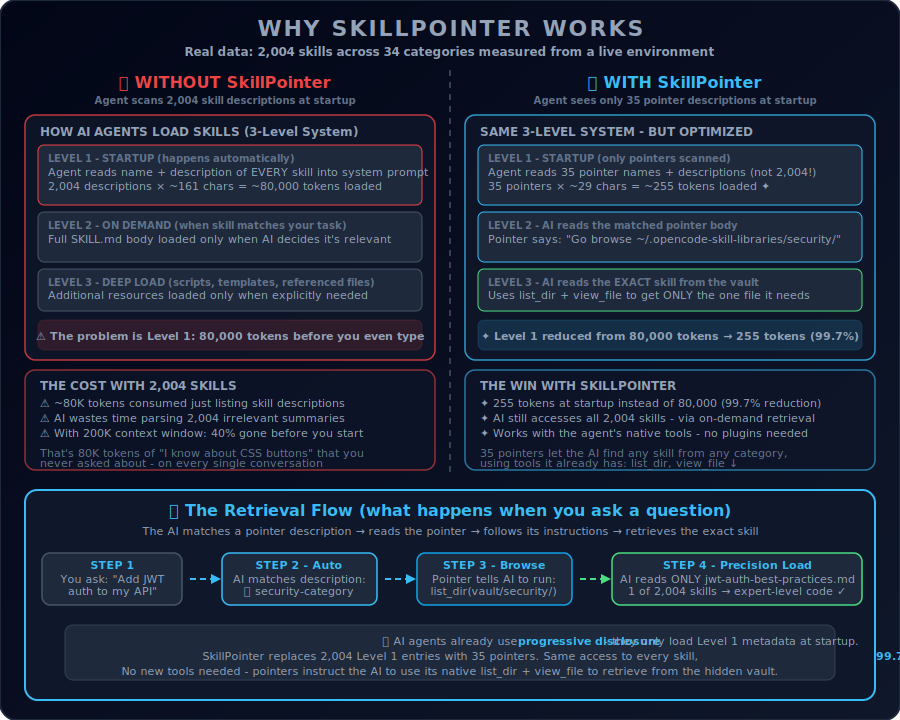

<div align="center">
  

  # SkillPointer 🎯

  **Infinite AI Context. Zero Token Tax.**

  [](https://opensource.org/licenses/MIT)
  [](https://www.python.org/downloads/)
  [](https://opencode.ai)
  [](https://docs.anthropic.com/en/docs/claude-code)
</div>

<br/>

SkillPointer is an **organizational pattern** for AI development agents (OpenCode, Claude Code, and others) that solves a specific scaling problem: when you have hundreds or thousands of skills installed, the startup token cost becomes massive.

It works **with** the native skill system, not against it - using skills to optimize skills.

---

## 🛑 The "Token Tax" Problem

AI agents like OpenCode and Claude Code use a [**3-level progressive disclosure**](https://opencode.ai/docs/skills) system to load skills:

| Level | When | What Loads |
|---|---|---|
| **Level 1** | At startup, automatically | `name` + `description` of EVERY skill into `<available_skills>` |
| **Level 2** | When AI matches a skill | Full `SKILL.md` body (instructions) |
| **Level 3** | When explicitly referenced | Scripts, templates, linked files |

**The problem is Level 1.** Even though full skill content loads on-demand, the agent still loads the name and description of *every single skill* into the system prompt at startup - on every conversation.

With a large library this adds up fast:

| Skills Installed | Level 1 Startup Cost | % of 200K Context Window |
|---|---|---|
| 50 skills | ~4,000 tokens | ~2% ✅ |
| 500 skills | ~40,000 tokens | ~20% ⚠️ |
| **2,000 skills** | **~80,000 tokens** | **~40%** 🛑 |

* **It slows down AI response times** - the agent has to parse thousands of skill descriptions before reasoning.
* **It inflates API costs** - ~80K tokens consumed every single prompt just listing skills.
* **It degrades reasoning** - [research shows](https://arxiv.org/abs/2307.03172) LLMs perform worse with longer contexts ("lost in the middle" problem).

<div align="center">
  
</div>

---

## ⚡ The Pointer Solution

<div align="center">
  
</div>
<br>

SkillPointer works *with* the native skill system by reorganizing your library:

1. **Hidden Vault Storage:** It moves all raw skills into an isolated directory (`~/.opencode-skill-libraries/`). The agent's startup scanner cannot see them here - so they don't appear in `<available_skills>`.
2. **Category Pointers:** It replaces 2,000 skills with ~35 lightweight "Pointer Skills" in your active `skills/` directory (e.g., `security-category-pointer`). Each pointer is a native `SKILL.md` that indexes an entire category.
3. **Dynamic Retrieval:** When you ask a question, the AI matches the relevant category pointer. The pointer instructs the AI to use its **native tools** (`list_dir`, `view_file`) to browse the hidden vault and read the exact skill file it needs.

### Real Measured Results

These numbers are from a live environment with 2,004 skills across 34 categories:

| Metric | Without SkillPointer | With SkillPointer |
|---|---|---|
| Level 1 entries | 2,004 descriptions | 35 pointer descriptions |
| **Startup tokens** | **~80,000** | **~255** |
| Context used | ~40% of 200K window | ~0.1% of 200K window |
| Skills accessible | 2,004 | 2,004 (identical) |
| **Reduction** | - | **99.7%** |

---

## 🚀 Installation & Setup

A zero-dependency Python script that converts your skills directory into a Hierarchical Pointer Architecture.

### Step 1: Run the Setup Script
Download and run `setup.py`. It automatically categorizes your skills into expert domains (e.g., `ai-ml`, `security`, `frontend`, `automation`) using a keyword heuristic engine.

By default, the script targets OpenCode. You can specify Claude Code using the `--agent` flag:

**For OpenCode:**
```bash
python setup.py
# Targets: ~/.config/opencode/skills
# Vault: ~/.opencode-skill-libraries
```

**For Claude Code:**
```bash
python setup.py --agent claude
# Targets: ~/.claude/skills
# Vault: ~/.skillpointer-vault
```
*(Note for Claude Code: The `.skillpointer-vault` directory is intentionally prefixed with a dot so Claude's aggressive file scanner natively skips it during Level 1 context hydration).*

### Step 2: Test It!
Start your AI agent and ask it to fetch a specific skill:
> *"I want to create a CSS button. Please consult your `web-dev-category-pointer` first to find the exact best practice from your library before writing the code."*

Watch the execution logs:
1. The AI reads the pointer (Level 2 load - just the pointer body).
2. The AI uses its native `list_dir` to browse the hidden vault.
3. The AI reads *only* the specific skill file it needs.
4. It generates expert-level code.

---

## 🛠 Manual Implementation Guide

If you prefer to set this up manually without the `setup.py` script:

1. Create a hidden library directory (e.g., `~/.opencode-skill-libraries/animation`)
2. Place your actual skill folders inside that directory.
3. Create a `SKILL.md` Pointer File inside your active `~/.config/opencode/skills/animation-category-pointer/` directory that tells the AI where to look. (See the setup script for the optimal pointer prompt formula).

---

## ❓ FAQ

<details>
<summary><b>"Isn't this just the same as Claude/OpenCode skills?"</b></summary>
<br>

**Yes - and that's the point.** SkillPointer isn't a plugin, library, or replacement for native skills. It IS native skills, organized in a specific pattern to solve a scaling problem.

The native skill system works great with 50 skills. With 2,000 skills, Level 1 loading alone consumes ~80K tokens. SkillPointer compresses that from 2,000 entries to 35 category pointers - same access to every skill, 99.7% less startup overhead.

Think of it like this: having 2,000 files in one folder vs. organizing them into 35 labeled folders with an index card on each one. The files are the same - the organization is what matters at scale.
</details>

<details>
<summary><b>"But skills already load on-demand!"</b></summary>
<br>

Correct - the **full skill body** (Level 2) loads on-demand. But the **name + description of every skill** (Level 1) still loads at startup. This is documented in the [official OpenCode docs](https://opencode.ai/docs/skills) - agents inject an `<available_skills>` section into the system prompt listing every skill.

With 2,000 skills, that's ~80K tokens just for the index. SkillPointer compresses that index from 2,000 entries to 35.
</details>

<details>
<summary><b>"Can't the AI handle 2,000 skill descriptions?"</b></summary>
<br>

It's not about capability - it's about efficiency. Every token in `<available_skills>` costs money and time. Research on the ["lost in the middle" problem](https://arxiv.org/abs/2307.03172) shows LLMs perform worse with longer system prompts. Reducing from 2,000 options to 35 categories makes skill selection faster, cheaper, and more accurate.
</details>

<details>
<summary><b>"How is retrieval different from the native skill tool?"</b></summary>
<br>

The native `skill()` tool loads a skill the AI already knows about (from Level 1). SkillPointer pointers instruct the AI to use `list_dir` and `view_file` to *discover* skills it doesn't know about yet - browsing the hidden vault to find the exact file. It's a different retrieval path that bypasses the need for all skills to be in Level 1.
</details>

---

## 📚 How It Works (Technical Details)

SkillPointer leverages the way AI agents handle skills, as documented by [OpenCode](https://opencode.ai/docs/skills) and [Claude Code](https://docs.anthropic.com/en/docs/claude-code/skills):

1. **At startup**, the agent scans all `SKILL.md` files and injects their `name` + `description` into an `<available_skills>` XML block in the system prompt.
2. **SkillPointer moves** 2,000 raw skill folders to a hidden vault directory outside the scan path.
3. **SkillPointer creates** 35 category pointer skills in the scan path. Each pointer's `SKILL.md` contains instructions telling the AI to browse the vault using its native file tools.
4. **At runtime**, the AI matches a pointer, reads its body, follows the instructions, and retrieves exactly the skill it needs from the vault.

No custom tools, no plugins, no API calls. Just smart organization of native skills.

---

<details>
<summary><b>View Star History</b></summary>
<br>
<div align="center">
  
</div>
</details>

<br>

<div align="center">
  <i>Open-sourced to optimize AI environments for developers everywhere. Built by breaking the limits of agentic workflows.</i>
</div>
